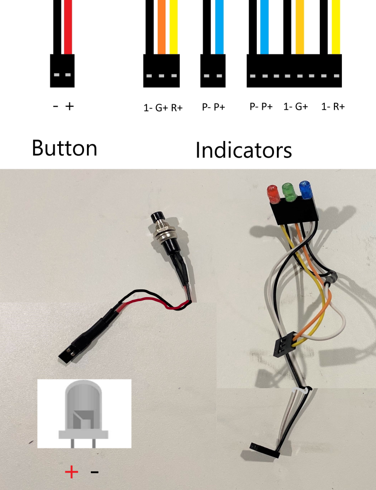

<div align=center>


</div>

***

# Build & Setup Guide

This is the build guide for SPARK's 2023 WRO Future Engineers solution - SPARK G2. It is segmented into ***TBD*** main steps, with more detailed steps within. It assumes you have necessary tools and miscellaneous materials including but not limited to: M2.5, M3 driver bits; a Dupont connector crimpange kit; a 3D printer; a soldering iron; 20-24 gauge wire; and M2.5, M3 flat/countersunk screws.

Below is a more-or-less detailed step-by-step guide to recreate SPARK g2.

***

# Contents

* [Parts List](#parts-list)
* [Chassis Assembly](#chassis-assembly)
* [Jetson Nano Setup](#jetson-nano-setup)
    * [Board Setup, SSHFS, Static IP](#board-setup-sshfs--static-ip)
    * [Enable GPIO & I2C](#enable-gpio-and-i2c)
    * [Install Packages](#package-installation)
    * [Remove GUI, Autologin, & Run-on-startup](#text-only-auto-login--run-on-startup)
    * [SPARK Control Panel Setup](#setup-for-spark-control-panel)
    * [Camera Calibration](#camera-calibration)

***

## Parts List

*There may be items not listed that are used in the build guide, we apologize if that happens.*

***

## Chassis Assembly

Sorry! We couldn't get detailed step-by-step instructions in time! Print out the parts located in `/dist/3d-model/`. in their given orientation (they have been oriented for the best print results) Most of the assembly should be fairly simple (the rear axle assembly should be bought from [Schumacher Racing's site](https://www.racing-cars.com/gt12/atom-2/) and NOT PRINTED), and follow the [pinout sheet](https://docs.google.com/spreadsheets/d/1WAe1DtCbWhLoC4L6yzJYvS99iHG4yAiWakqxsy8os7s/edit?usp=sharing) and connect to their corresponding pins on the other boards. Some holes may need to be drilled out and some crimping may have to be done.

If you need a reference model we have our [OnShape document linked](https://cad.onshape.com/documents/82dd14d30b814e8846567203/w/34e1b6a4058ed5fbde8ef66a/e/47aa4028e09ec17a24a63590). (The ESC and IMU have not been modeled. The ESC goes in the rear, within the raised rectangle. The IMU should be mounted to the 4 unpopulated holes with M2.5 screws.)

Follow the diagram below to wire the button and indicator LEDs.


*Note: For I2C connectors, Yellow should be SCL and blue should be SDA; there is no set standard.*

For soldering, we recommend soldering the regulators to their own connectors **in parallel**, and using that as a pass-through to the ESC. The female connectors should be used on the ESC inputs and regulator input, and the male connector on the pass through end of the regulator wires. See the diagram below.


Follow the quick start guide for the ESC to solder the motor connections. Brief summary: solder A, B, and C connectors to the motor (or supplied connectors). Ensure the sensor wire is secure before mounting motor and ESC.

**WARNING:** DO NOT CONNECT THE ESC 3-PIN DIRECTLY TO THE SERVO DRIVER! IT WILL BACKDRIVE THE REGULATOR AND BREAK IT! ONLY CONNECT THE PWM PIN (white)!

***

## Jetson Nano Setup

### Board Setup, SSHFS, & Static IP

Visit [Yahboom](http://www.yahboom.net/)'s [setup and tutorial repository](http://www.yahboom.net/study/jetson-nano) to begin setting up the [Jetson Nano 4GB](https://category.yahboom.net/collections/jetson/products/jetson-nano-sub). Follow steps 1.1-1.7 in "Development setup > SUB Version".

-> http://www.yahboom.net/study/jetson-nano

After setting up the board, follow step 2.1 in section "Basic Settings" to log into your Jetson Nano. Keep PuTTY open, as it will be used for the rest of the setup process. Also keep the IP. For remote file transfer, install sshfs (linux only), or use [sshfs-win](https://github.com/winfsp/sshfs-win) from WinFsp. Follow instructions to mount the Jetson Nano to a network drive. Now upload all contents of the `/Program/` folder into a new folder on the Jetson Nano. Remember the directory of the folder, this will be used later.

*This method should be used to upload programs.*

Make sure a static IP is set to the board to make SSH and file transfer easier. Go to your router settings and [assign a DHCP reservation (PCmag)](https://www.pcmag.com/how-to/how-to-set-up-a-static-ip-address) (or a straight static IP) to your Jetson Nano. Save this IP in your PuTTY settings and SSHFS mounting.

### Enable GPIO and I2C

Next, setting up the board for the application. First, enable GPIO and I2C. Create a new user group, and add your user to it (this is the user running the commands).

```
sudo groupadd -f -r gpio
sudo usermod -a -G gpio your_user_name
```

Copy `99-gpio.rules` from `/dist/` in the project folder to `/etc/udev/rules.d/` on the Jetson Nano. Then enable the rule.

```
sudo udevadm control --reload-rules && sudo udevadm trigger
```

<!-- Now enable PWM. Run the options file for jetson-GPIO.

```
sudo /opt/nvidia/jetson-io/jetson-io.py
```

Go down to "Configure 40-pin expansion header" and enter that submenu. Find `pwm0` and `pwm`, and enable them by selecting them and pressing "Enter". Now exit the tool. GPIO and PWM have been enabled. -->

You may need to enable permissions for I2C

```
sudo usermod -a -G i2c your_user_name
```

### Package Installation

Some packages will need to be installed. [Jetson-GPIO](https://github.com/NVIDIA/jetson-gpio), socket.io-client, [adafruit-servokit](https://github.com/adafruit/Adafruit_CircuitPython_ServoKit), and [adafruit-mpu6050](https://github.com/adafruit/Adafruit_MPU6050) must be installed (Jetson-GPIO may be pre-installed on some versions).

Use the following pip commands:

```
pip3 install adafruit-circuitpython-servokit adafruit-mpu6050 "python-socketio[client]"
```

### Text-Only, Auto-Login, & Run on Startup

Switch the Jetson Nano to text-only mode (gui is almost useless for this application and only causes unneccesary slowness).

```
sudo systemctl set-default multi-user.target
```

Autologin must be done to avoid having to plug in a monitor and keyboard to start ssh and run programs. The following accomplishes it:

```
sudo systemctl edit getty@tty1
```

A temporary editor will appear. Place the following text in it, replacing "your_user_name" with your user name.

```
[Service]
ExecStart=
ExecStart=-/sbin/agetty -o '-p -f your_user_name' -a your_user_name --noclear %I $TERM
```

Save and close the editor with `:wqa`.

To run the program on startup, first obtain the directory of the program folder uploaded earlier. Create `spark_startup.service` in `/etc/systemd/system` and place the following in the contents, replacing "/filepath/" with the absolute directory of the folder (begins with a "/").

```
[Service]
WorkingDirectory=/filepath
ExecStart=/usr/bin/python3 -u /filepath/startup.py
User=username

[Install]
WantedBy=multi-user.target
```

Save the file and add permissions to it.

```
sudo chmod 644 /etc/systemd/system/spark_startup.service
systemctl enable /etc/systemd/system/spark_startup.service
```

If you wish to use the SPARK Control Panel, repeat the above steps to create a second startup service (`spark_server.service`). The contents should look like the below:

```
[Service]
WorkingDirectory=/filepath
ExecStart=/usr/bin/node /filepath/Util/server.js
User=username

[Install]
WantedBy=multi-user.target
```

Make sure to add the same permissions as `spark_startup.service`.

Reboot the Jetson Nano to test if these changes worked. No GUI should appear and you shuld be automatically logged in.

Enable run-on-startup by editing `run-on-startup.txt` in the folder. Replace the first line with `true`.

Go to `startup.py`, and change `path` to the absolute filepath of your directory (same as filepath in the previous steps)

Example:

```
path = '/home/nano/Documents/SPARK_FutureEngineers_2023/'
```

Reboot the Jetson Nano again

### Setup for SPARK Control Panel

SPARK uses a debugging server (SPARK Control Panel) for quick development and real-time monitoring. It runs on a separate Node.js process and is not needed. If you want access to the SPARK Control Panel you must install Node.js and dependencies.

```
sudo apt install nodejs
```

*NOTE: The default installation of node may be v12, which doesn't support some features. To install newer versions, try the following:*

```
sudo snap install node --channel=16 --classic
sudo update-alternatives --install /usr/bin/node node /snap/bin/node 0
```

*This should install Node.js v16 and set it to be the main version of node used with the "node" command.*

Navigate to `/Util/` and install dependencies.

```
npm install
```

For the authentication system to work properly (not actual authentication, just a UUID exchange to prevent people from sending bogus signals) `auth.json` must be created in `/Util/`.

```
vim auth.json
```

The contents should be a single UUID:

```
"214e7634-b7c3-4044-b297-533da8cfbe7f"
```

This UUID should also be present on client devices, along with the IP of the car (set earlier). On the client devices, create `/SPARK-Util/SPARK-Control/config.js`.

Example:

```
const ip = '192.168.1.151';
const auth_uuid = '214e7634-b7c3-4044-b297-533da8cfbe7f';
```

To open the SPARK Control Panel and other utilities, run `node SPARK-Util/static.js` on a local terminal (your computer) or open the batch file `/SPARK-Util/static.bat`. In a web browser (only Chrome tested), navigate to `localhost:8081` to access the SPARK Control Panel.

### Camera Calibration

You may encounter pink fringing on the cameras. If that happens, take the following steps to fix it:

Copy `camera_overrides.isp` from `/dist/` in the project folder to `/var/nvidia/nvcam/settings/` on the Jetson Nano.

Give the overrides permissions with the next two:

```
sudo chmod 664 /var/nvidia/nvcam/settings/camera_overrides.isp
sudo chown root:root /var/nvidia/nvcam/settings/camera_overrides.isp
```

Next, calibrate the cameras. If you skip this step, the distortion correction may have error and the program may not function as intended.

First, you need to run manualdrive and take pictures of a chessboard. Take roughly 10 pictures. Place these pictures in `dist/calibration`, and then run the first cell of `calibrate.ipynb`. The program should print out DIM, K, and D. If there is an error, make sure all the pictures have the full size of the chessboard. Paste these values of DIM, K, and D into the second cell where it says `# Paste matrices here`. Run the second cell to ensure the distortion matrices work. Now you can paste K and D into `converter.py`, at line 25.